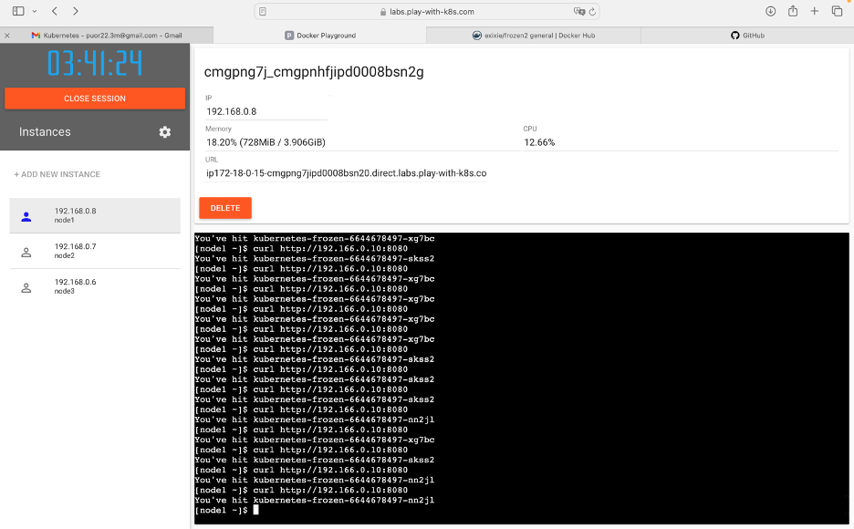

<h1>Виртуализация и контейнеризация - Лабораторная работа №3</h1>

<h2>Бадараева Анна ПУОР22-2м</h2>

***<h3>Задания по Kubernetes:</h3>***

**Задание 1.** Эксперимент с ReplicaSet. Приложение будет показывать имя пода, к которому обращается клиент.

